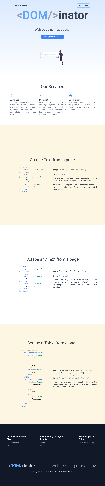
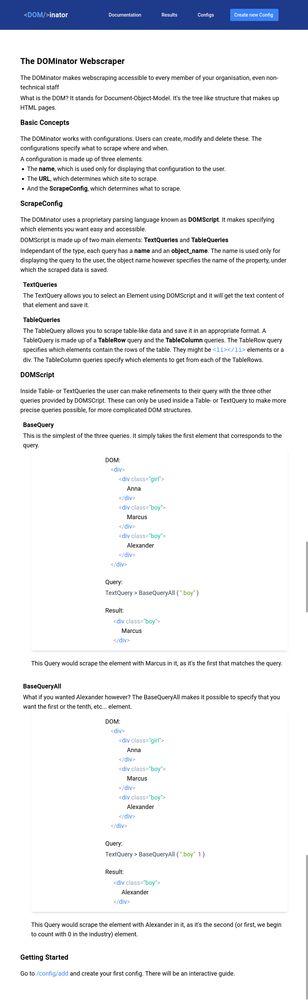

# The site

This is the page that greets the users when they first open the page:

This site explains the system to the users:

This is what a users sees when creating a config:

This is the page where users can look at their configs after creating them:

This is the list of the scraping results users see after the page was scraped a few times:

This is what the results look like exactly:

The data after it's been exported from the site:

