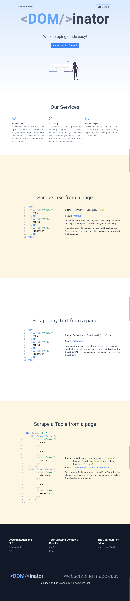
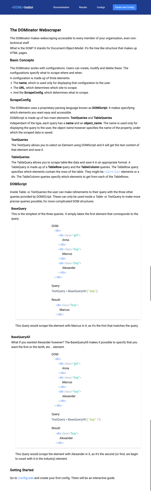

# DOMinator


*What if you wanted to analyse the wins and losses of your favourite football teams, but you couldn't find an API to get the data from?*

You would want to use a webscraper to periodically scrape a page. But setting one up, and creating the scripts, and configuring cron takes valuable time that you could use to analyse the data.

## My solution

That's were the **DOM**inator comes in. It allows you to configure a webscraper using a simple declarative syntax and setup a cron intervall. The **DOM**inator will then automatically fetch the site, scrape the data and make it availiable in JSON, CSV and via a MongoDB database.

## Interesting Things about this project

I had to create a custom declarative language based on JSON, which the users could use to specify what to scrape.

I wrote an interpreter/parser for this "language" (`src/backend/dominator-parser`). It recursively goes through the queries and gets the elements. [In depth explanation of the interpreter](./src/backend/dominator-parser/Readme.md)

On the frontend side, I had to create a dynamic editing experience that would allow users to preview what they fetched from the page ([Demo](#specifying-what-information-you-want-from-the-page)).

## The interpreter / parser is explained in-depth here:

It features a visual explanation of the Query Language.
### [In depth explanation of the interpreter](./libs/parser/Readme.md)

## The tech-stack

This project uses a [NestJS](https://nestjs.com/) backend and an [Angular](https://angular.io/) frontend. The database is a MongoDB database.

## Images

### The Landing Page


## How The DOMinator works

The first step to setting up a webscraper with DOMinator is to create a "ScrapeConfig". You have to set the name of the ScrapeConfig, the url of the page you want to scrape and specify what information you want to extract.

The image below is a screenshot of the docs page, please read it to understand how the parser works.

### The Docs


### This is what a finished ScrapeConfig looks like


Once the user has entered the URL of the page he wants to scrape, he can press `Get Preview`. The server will then create a screenshot of the page and save the entire DOM. It then sends that data back to the frontend.

### Specifying what information you want from the page


As a tree, this query would look like this:


A more complex query might look like this:


## Getting started

To run the backend, execute these commands:

```bash
cd ./src/backend
npm install
docker-compose up -d
npm run start:dev

```

```bash
cd ./src/frontend
npm install
ng serve
```