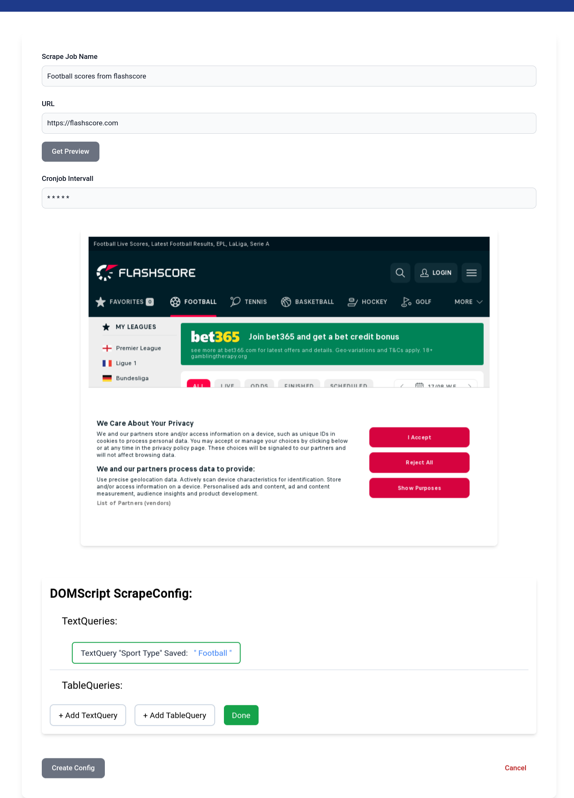
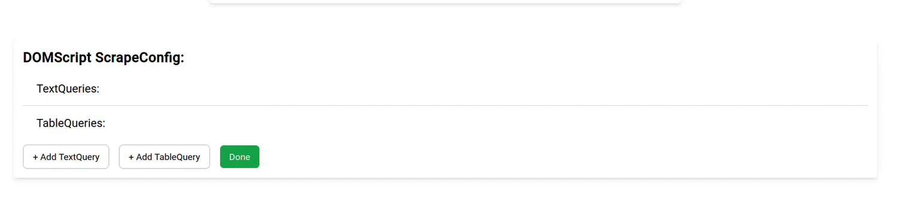
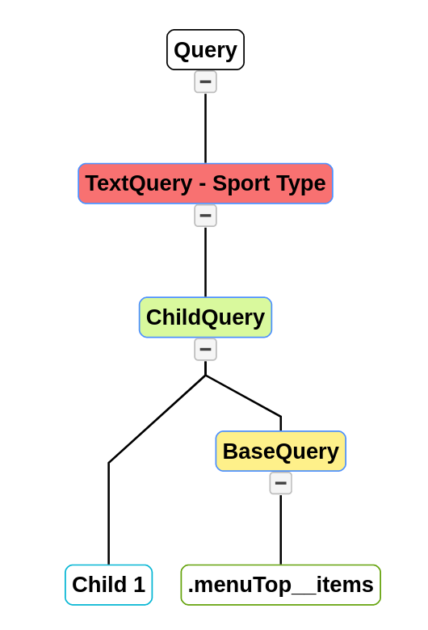
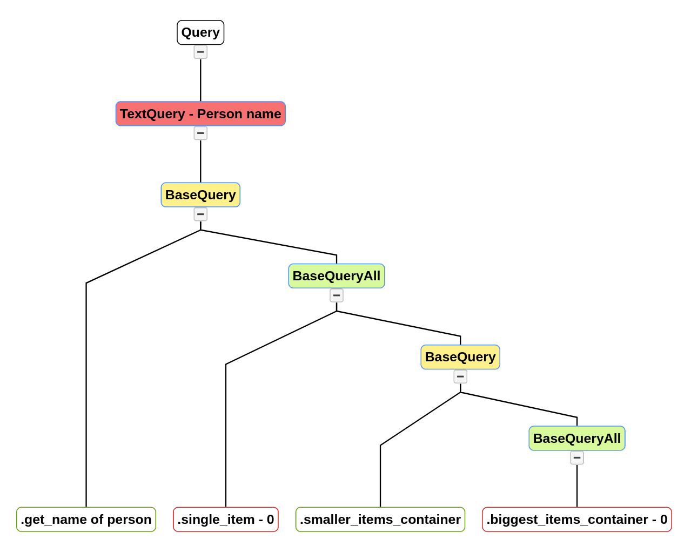

# DOMinator


*What if you wanted to analyse the wins and losses of your favourite football teams, but you couldn't find an API to get the data from?*

You would want to use a webscraper to periodically scrape a page. But setting one up, and creating the scripts, and configuring cron takes valuable time that you could use to analyse the data.

## My solution

That's were the **DOM**inator comes in. It allows you to configure a webscraper using a simple declarative syntax and setup a cron intervall. The **DOM**inator will then automatically fetch the site, scrape the data and make it availiable in JSON, CSV and via a MongoDB database.

## Interesting Things about this project

I had to create a custom declarative language based on JSON, which the users could use to specify what to scrape.

I wrote an interpreter/parser for this "language" (`src/backend/dominator-parser`). It recursively goes through the queries and gets the elements. [In depth explanation of the interpreter](./src/backend/dominator-parser/Readme.md)

On the frontend side, I had to create a dynamic editing experience that would allow users to preview what they fetched from the page ([Demo](#specifying-what-information-you-want-from-the-page)).

## [Images of the site](.github/images.md)

You can find a "walkthrough" of the site in this markdown file.

[Images of the site](.github/images.md)

## [The interpreter / parser is explained in-depth here:](./libs/parser/Readme.md)

It features a visual explanation of the Query Language.

[In depth explanation of the interpreter](./libs/parser/Readme.md)

## The tech-stack

The project is a monorepo created with [NX](https://nx.dev/).
This project uses a [NestJS](https://nestjs.com/) backend and an [Angular](https://angular.io/) frontend. The database is a MongoDB database.

## How The DOMinator works

The first step to setting up a webscraper with DOMinator is to create a "ScrapeConfig". You have to set the name of the ScrapeConfig, the url of the page you want to scrape and specify what information you want to extract.

The image below is a screenshot of the docs page, please read it to understand how the parser works.

### The Queries

#### Scrape Text from a page

```html
<div>
  <div class="girl">
    Anna
  </div>
  <div class="boy">
    Marcus
  </div>
  <div class="boy">
    Alexander
  </div>
</div>
```

**Query** `TextQuery > BaseQuery ( ".boy" )`

**Result** `"Marcus"`

To scrape text from a website, use a TextQuery. It can be as simple or complex as the website you are scraping.
Nested Queries? No problem, use nested BaseQueries.
Div's without class or id? No problem, use nested ChildQueries.

#### Scrape any Text from a page

```html
<div>
  <div class="girl">
    Anna
  </div>
  <div class="boy">
    Marcus
  </div>
  <div class="boy">
    Alexander
  </div>
</div>
```

**Query** `TextQuery > BaseQueryAll ( ".boy" 1)`

**Result** `"Alexander"`

To scrape any text, no matter if it's the first, second or hundreth element on a website, use a TextQuery and a BaseQueryAll. It supplements the capabilities of the BaseQuery. 

#### Scrape a Table from a page

```html
<div class="table">
    <div class="element">
        <p class="name1">
            Anna
        </p>
        <p>
            and
        </p>
        <p class="name2">
            Marcus
        </p>
    </div>
    <div class="element">
        <p class="name1">
            Alexander
        </p>
        <p>
            and
        </p>
        <p class="name2">
            Ferdinand
        </p>
    </div>
</div>
```

**Query** `TableQuery > Row: BaseQuery ( ".element") > Column: BaseQuery ( ".name1") > Column: BaseQuery ( ".name2") `

**Result** `"Anna, Marcus" , "Alexander, Ferdinand"`

To scrape a Table, you have to specify a Query for the element equivalent of a row and the elements to select from inside that row element. 

### This is what a finished ScrapeConfig looks like


Once the user has entered the URL of the page he wants to scrape, he can press `Get Preview`. The server will then create a screenshot of the page and save the entire DOM. It then sends that data back to the frontend.

### Specifying what information you want from the page



As a tree, this query would look like this:



A more complex query might look like this:



## Getting started

To run the backend project either use the NX commands:

```bash
docker-compose -f docker-compose.dev.yml up
nx run-many --target=serve --all=true
```

Or run it with docker:

```bash
docker-compose -f docker-compose.yml build
docker-compose -f docker-compose.yml up
```